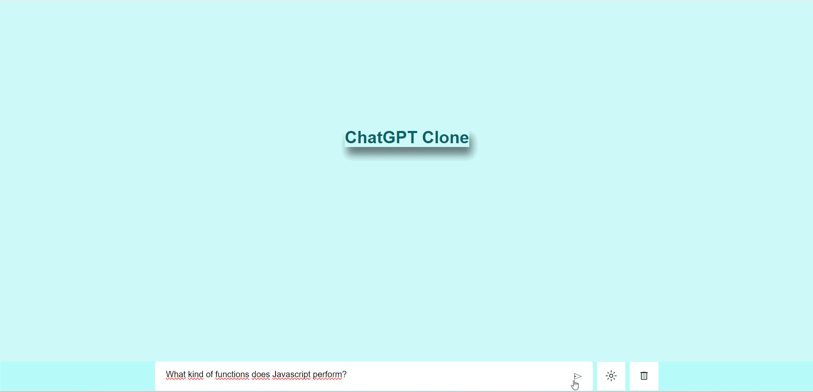

Popüler Yapay Zeka Uygulaması ‘ChatGPT’ Klon Projesi.
Projeye Genel Bakış;
 
Yazılımcıların kendi uygulamalarının diğer sistemlere entegre etmelerini, veri alışverişi yapmalarını ve hizmetlerini(harita verilerini çekme vb.) paylaşmalarını, diğer deyişle bir yazılım programının diğer yazılım programına erişmesine olanak sağlayan API (Application Programming Interface) kullanımı, popüler ChatGPT programının klonlanması yoluyla bu projede uygulanmıştır.
 
Harici Kütüphane;
Google Fonts.

<h1>ChatGPT-CLONE-PROJECT</h1>

 ChatGPT Klon projesinde HTML5, CSS3 ve JS kodları kullanılmıştır. 

<h3>Nasıl Kullanabilirsiniz!</h3>

1. Proje dosyalarını indirebilir veya klonlayabilirsiniz.
2. `index.html` dosyasını açın ve projeye göz atın.

<h3>Features</h3>

- İleri seviyede HTML 5, CSS ve Js kodları kullanılmıştır.
- Proje Responsive tasarıma sahiptir.
-  Google fontları ile zenginleştirilmiştir
Soru ve katkılarınız için , [gkarakaya0601@gmail.com](mailto:email@example.com).

